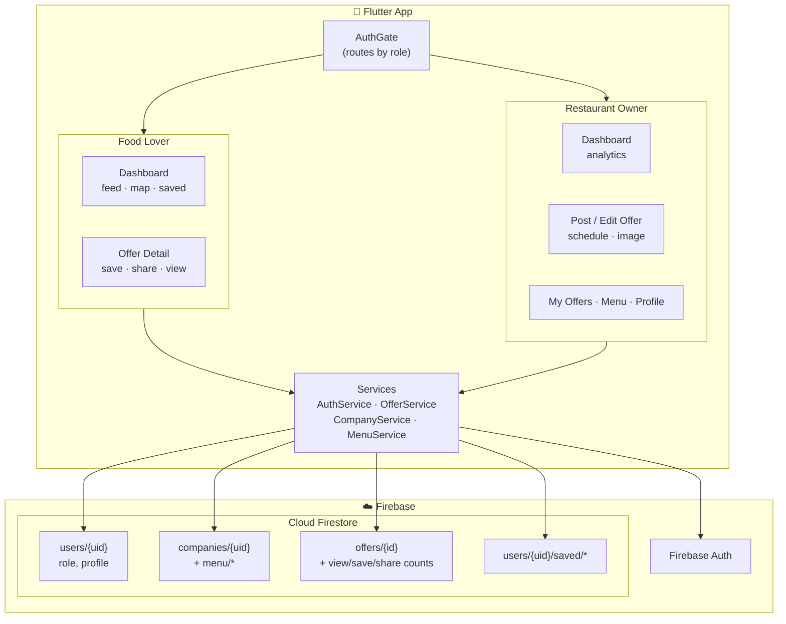

<p align="center">
  
</p>

<p align="center">
  
  
  
  
</p>

<h1 align="center">DishDash 🍽️</h1>

<p align="center">
  <b>Find the tastiest food deals around you — and let restaurants reach hungry customers.</b>
</p>

DishDash is a two-sided food-offers marketplace. **Restaurant owners** post and schedule
offers, manage a menu, and track how each deal performs. **Food lovers** discover live
offers on a map, save their favourites, and share the best deals with friends.

---

## ✨ Features

### 🧑‍🍳 For Restaurant Owners
- **Post & schedule offers** — image, price, discount, promo code, publish-now or future go-live, and expiry.
- **Business analytics dashboard** — total views, saves, shares, and active offers, plus a *Top Performing* list.
- **Per-offer insights** — views / saves / shares tracked live on every offer.
- **Menu management** — add dishes with photos and prices.
- **Restaurant profile** — logo, description, cuisines, location, contact.

### 🍕 For Food Lovers
- **Live offers feed** with search, plus a **map** of nearby restaurants (OpenStreetMap).
- **Save / unsave** offers to a personal collection.
- **Share to social** — send deals to friends via the native share sheet.
- **Guest browsing** — explore and share without an account (save requires sign-in).

### 🔐 Shared
- **Role-based auth** — one sign-up flow, two experiences (foodie vs owner), routed automatically.
- **Stay signed in** across launches, **dark mode**, and password reset.

---

## 🖼️ Screens

> _Add your screenshots to `docs/screenshots/` and reference them below._

| Owner Dashboard | Post Offer | Foodie Feed | Offer Detail |
| :-: | :-: | :-: | :-: |
| _dashboard.png_ | _post-offer.png_ | _feed.png_ | _detail.png_ |

---

## 🏗️ Architecture

DishDash is a Flutter client backed entirely by **Firebase** — no custom server to run.
Images are stored as compressed **base64 strings inside Firestore documents**, and offer
status (`scheduled` / `active` / `expired`) is computed client-side from timestamps.



### Data model

| Collection | Purpose | Key fields |
| --- | --- | --- |
| `users/{uid}` | Account + role | `name`, `email`, `role: foodie \| owner` |
| `companies/{uid}` | Restaurant profile (doc id = owner uid) | `name`, `description`, `latitude/longitude`, `cuisineTypes`, `logoBase64` |
| `companies/{uid}/menu/{id}` | Menu dishes | `name`, `price`, `imageBase64` |
| `offers/{id}` | Promotional offers | `companyId`, `scheduledAt`, `expiresAt`, `viewCount`, `saveCount`, `shareCount` |
| `users/{uid}/saved/{offerId}` | A foodie's saved offers | denormalized offer copy |

---

## 🚀 Getting Started

### Prerequisites
- Flutter SDK (3.44+) and an Android emulator / device
- A Firebase project with **Authentication (Email/Password)** and **Cloud Firestore** enabled

### 1. Clone & install
```bash
git clone https://github.com/Danial-Dirar/CSE47020_DishDash.git
cd CSE47020_DishDash
flutter pub get
```

### 2. Firebase config
This repo already ships `lib/firebase_options.dart` and `android/app/google-services.json`
(project `dishdash-3136e`). To point it at **your own** Firebase project instead:
```bash
dart pub global activate flutterfire_cli
flutterfire configure
```

### 3. Firestore security rules
In the Firebase Console → Firestore → **Rules**, publish:
```
rules_version = '2';
service cloud.firestore {
  match /databases/{database}/documents {
    match /companies/{uid} {
      allow read: if true;
      allow write: if request.auth != null && request.auth.uid == uid;
      match /menu/{itemId} {
        allow read: if true;
        allow write: if request.auth != null && request.auth.uid == uid;
      }
    }
    match /offers/{offerId} {
      allow read: if true;
      allow write: if request.auth != null;
    }
    match /users/{uid} {
      allow read, write: if request.auth != null && request.auth.uid == uid;
      match /saved/{offerId} {
        allow read, write: if request.auth != null && request.auth.uid == uid;
      }
    }
  }
}
```

### 4. Run
```bash
flutter run
```

> **Maps note:** DishDash uses **OpenStreetMap** via `flutter_map` — no Google Maps API key or billing required.

---

## 🧭 Roadmap
- Follow favourite restaurants + push notifications on new offers
- Filters (cuisine, distance, discount %) and offer categories
- Reviews & ratings, redeem/claim history with QR codes
- Owner-side offer boost and best-time-to-post insights
- Custom launcher icon + splash screen

---

## 🛠️ Tech Stack
**Flutter** · **Firebase Auth** · **Cloud Firestore** · **flutter_map / OpenStreetMap** ·
**geolocator** · **image_picker** · **share_plus** · **provider**

---

## 👤 Author
**Muhammad** — [@kahfijuhaifa](mailto:kahfijuhaifa@gmail.com)

> Built as part of CSE47020.
